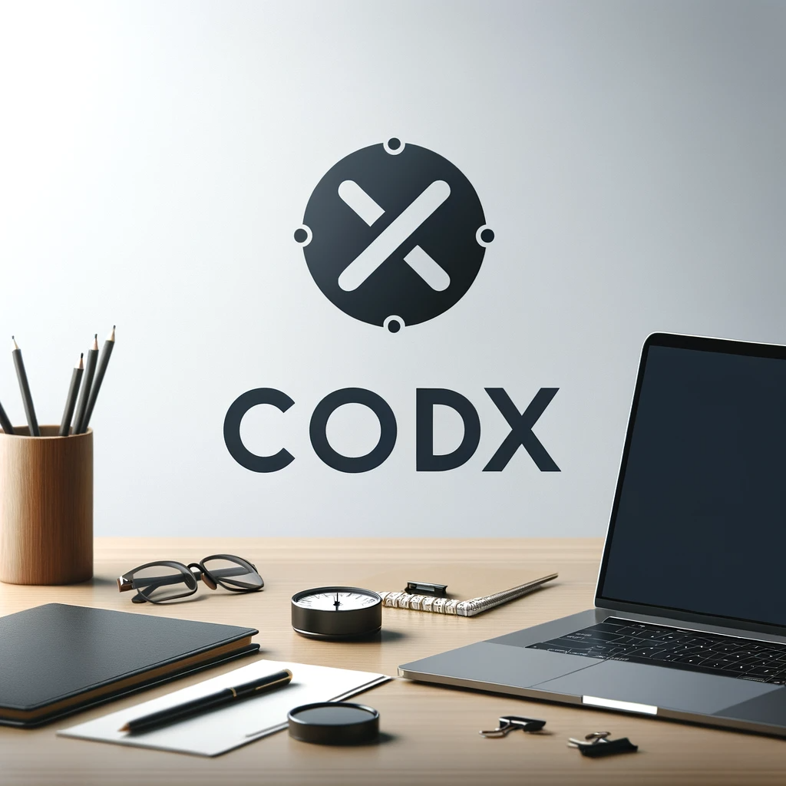

# CoDex Pallet Documentation

 

The CoDEX Pallet Project is a Decentralized Exchange designed for the Substrate blockchain framework. 
It enables the creation and management of liquidity pools for asset pairs, allowing users to trade different digital assets efficiently. 
The platform supports key functionalities such as initializing pools with specified asset pairs, adding or removing liquidity, and conducting asset swaps while maintaining liquidity balance. 
It employs a constant product formula to ensure liquidity and price stability. 
Additionally, the project incorporates a variety of error checks and safeguards to ensure smooth and secure operations. 

## Fee calculation

Our decentralized exchange (DEX) implements a fee mechanism to incentivize liquidity provision. 
The current fee structure is straightforward: a fixed percentage is deducted from the input amount of each swap transaction.

### Current Fee Logic
Fee Deduction: During each swap, a predetermined fee is subtracted from the amount of the asset being swapped. 
This approach encourages users to contribute liquidity to the pools, as it increases the potential for earning fees from swap transactions.
### Simplicity and Potential Drawbacks:
The current fee model is basic and does not account for the duration for which liquidity providers (LPs) have held their tokens in the pool. This could lead to a scenario where newer LPs gain a disproportionate advantage over long-term holders, as the fee benefits are immediate and uniform, regardless of holding duration.

### Future Enhancements
Dynamic and Fairer Fee System: We are planning to refine the fee calculation in upcoming releases. 
The new system will consider the length of time for which LPs have held their tokens in the pool. 
This change aims to create a more balanced and equitable fee distribution, 
rewarding long-term liquidity providers for their sustained contribution to the pool's health and stability.

### Conclusion
The fee mechanism is a crucial component of our DEX, 
balancing incentives between traders and liquidity providers.
While effective in its current form, we are committed to evolving this feature to better serve our diverse user base and enhance the 
overall fairness and efficiency of the platform. Stay tuned for updates in future releases.

## Price Oracle Functionality

Our DEX pallet includes a get_price function, which serves as a simple price oracle. 
This function allows users to query the current price ratio of a pair of assets from the liquidity pool. 
It is a read-only query and does not modify the state of the blockchain.

#### Purpose
The get_price function is designed to provide quick and easy access to market price information within the DEX. It is particularly useful for applications that require up-to-date pricing data for trading strategies, risk assessments, or other financial analyses.

### Functionality
#### Query Price Ratio: 
Retrieves the price of one asset in terms of another based on their current ratios in the liquidity pool.
#### Read-Only: 
Does not change the state of the blockchain and can be used for off-chain queries.
#### Error Handling: 
Includes checks for distinct assets and pool existence.

## Extrinsics Overview
The DEX pallet's extrinsics are designed to interact with liquidity pools on the blockchain, enabling the creation, management, and usage of these pools. Each extrinsic performs specific roles and has built-in checks to ensure transactions are valid and secure.

### initialise_pool_with_assets
#### Purpose: 
To create a new liquidity pool with two distinct assets. This extrinsic is the starting point for setting up a market for asset exchange.
#### Checks:
Ensures the assets are distinct.

Validates that the provided asset amounts are non-zero.

Confirms the creator's account balance is sufficient for both assets.

Verifies that the pool for the given asset pair doesn't already exist.

### add_liquidity

#### Purpose: 

To contribute additional assets to an existing liquidity pool. This is essential for users wanting to increase their share in a pool or improve the pool's depth.

#### Checks:

Confirms that the pool exists for the given asset pair.

Ensures the assets are distinct and the amounts are non-zero.

Verifies that the user’s balance is sufficient for the contribution.

#### Usage: 

Utilized by liquidity providers to enhance their stake in a pool, thereby increasing its total liquidity.

### remove_liquidity
#### Purpose: 

To withdraw a portion or all of a user's stake from a liquidity pool. This allows users to retrieve their assets plus any accrued fees.

#### Checks:

Validates the existence of the pool for the specified asset pair.

Confirms the user has enough liquidity tokens for the withdrawal.

Ensures the amounts received are not less than the specified minimums, guarding against excessive slippage.

#### Usage: 
Employed by users when they want to exit the pool or reclaim a portion of their assets.

### swap_assets
#### Purpose: 
To exchange one asset for another within a pool. This function is core to the DEX's functionality, enabling users to trade assets.
#### Checks:
Ensures the input and output assets are different and part of the same pool.

Confirms the user has enough of the input asset.

Validates that the output amount is not less than the user's minimum expectation.

#### Usage: 
Central to traders looking to exchange assets at prevailing market rates determined by the liquidity pool.

# Future Improvements
- Handling Large Pools: The current implementation uses a k coefficient in the swap calculations. As the pool size increases, there's a risk of overflowing the maximum value of k, potentially locking the swap functionality. Advanced mathematical logic from Substrate could be utilized to mitigate this issue.
- Precision in Calculations: Swaps and liquidity calculations use integer division, which may lead to precision loss, particularly with small asset amounts. Incorporating higher-precision mathematics could enhance accuracy.
- Adjustable Fee Structure: The current implementation has a constant fee. Future iterations could introduce a configurable or market-condition-dependent fee structure, adapting to different economic scenarios.
- Providing mechanisms to mitigate impermanent loss for liquidity providers could attract more users. This could involve compensatory mechanisms or innovative pool designs that reduce the impact of price divergence.
- Incorporating risk assessment tools, like price oracles or automated auditing systems, could help users make informed decisions and enhance platform security.
- Liquidity Mining and Yield Farming: Introduce mechanisms for liquidity mining and yield farming to incentivise users to provide liquidity.
- Slippage Protection Mechanism: Implement an enhanced slippage protection mechanism that provides better estimates and protections against unfavorable price movements during trades.
- User Interface (UI): create a user friendly UI for the swap.
